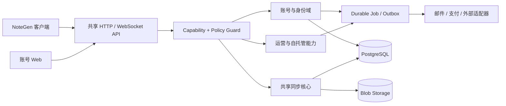
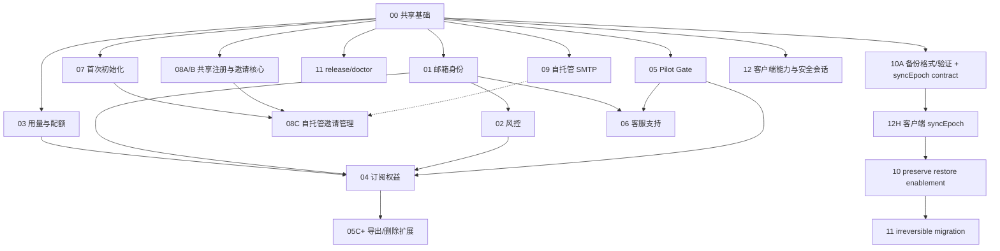

# NoteGen 账号服务开发计划总览

- 状态：Draft
- 日期：2026-08-11
- 面向读者：NoteGen Server、账号 Web、NoteGen 客户端的开发者与部署维护者
- 文档目标：把现有同步服务演进为可长期运营的账号服务，并允许每个功能按独立任务实施、验收、上线和回滚

## 1. 结论

下一阶段不继续扩张同步协议。同步、设备、加密、实时通知、后台管理和基础备份继续作为共享核心；新增能力围绕账号生命周期、运营策略和自托管可维护性展开。

产品固定为两种部署形态：

| 维度 | 官方托管 `hosted` | 自托管 `self-hosted` |
| --- | --- | --- |
| 身份 | 邮箱为主身份，必须验证，支持找回 | 用户名可继续使用；邮箱与 SMTP 可选 |
| 注册 | 由运营策略、邮箱验证和风控共同决定 | 首次初始化后默认关闭，可启用邀请或公开注册 |
| 风控 | 登录、注册、找回、设备和支付均受策略控制 | 保留本地限流与管理员手工封禁，不依赖外部风控 |
| 配额 | 账号级用量计量与服务端强制执行 | 默认不启用商业配额，可保留实例级安全上限 |
| 订阅 | 支付状态只产生权益，不直接修改同步数据 | 不加载计费入口和支付 Webhook |
| 合规 | 数据导出、删除、保留、同意记录和审计流程 | 提供基础导出/删除工具，法律责任由部署者承担 |
| 客服 | 工单、诊断授权、最小权限客服角色 | 不内置官方客服，可显示部署者配置的支持链接 |
| 运维 | 由官方基础设施和内部 Runbook 负责 | 提供首次初始化、邀请、SMTP、备份恢复和升级助手 |

`deploymentMode` 只决定部署策略和允许启用的能力，不复制同步核心，不建立两套数据库，也不允许前端自行决定权限。

## 2. 当前基线与必须先修正的边界

以下结论来自当前仓库，而不是未来设想：

- `DEPLOYMENT_MODE` 已在 `apps/server/src/config.ts` 中建模，并由 `/v1/capabilities` 返回；Web 也已经显示“官方托管 / 自托管”。当前它尚未参与路由注册、权限判断或服务策略，因此仍是展示字段。
- `/v1/capabilities` 已经是客户端发现协议与功能的入口。后续必须保持增量兼容，不能让客户端根据版本号猜测功能。
- 账号当前是任意 `login + password`；任何时刻只要不存在“有效管理员”，下一次普通注册都会自动成为全局管理员，不仅限于空库首位账号。全部管理员被停用/删除后也可能被接管，必须先从所有注册路径移除该隐式规则。
- PostgreSQL 已承载跨实例限流、维护 advisory lock、管理员审计、后台任务和数据库备份记录，可以继续作为账号服务一期的协调基础，无需为了运营功能立即引入 Redis 或消息队列。
- 当前管理后台备份只包含 PostgreSQL；单机脚本才会同时复制文件系统 Blob。恢复仍是手工流程。
- 当前同步实现同时保留历史 `SyncService` 和现用 `DurableSyncService`。两者共享对象/版本表，但写入日志不同。账号服务只能通过统一策略接口接入，不能把配额或审计逻辑只绑在其中一条路径上。
- NoteGen 客户端已校验 `instanceId`、协议范围和部分能力字段；现有 `registrationMode`、`login` 字段及错误响应需要维持兼容窗口。

## 3. 目标架构

关键约束：

1. `deploymentMode` 在一个数据库实例内固定；环境变量与数据库记录不一致时由全局 StartupSafetyGate 同时关闭业务 HTTP、WebSocket 和 worker，不能只依赖 readiness。
2. 能力开关由服务端统一解析。页面隐藏只是体验优化，路由和领域服务必须再次校验。
3. 未认证的 `/v1/capabilities` 只返回实例级可用性；账号的实际权益、用量和限制由认证后的账号上下文返回。
4. 支付、邮件和客服系统都是适配器。核心表保存内部状态与幂等记录，外部系统不能成为同步数据的事实来源。
5. 订阅到期、支付失败或超额不会自动删除数据；默认进入有期限的降级或只读状态。
6. 自托管不因未配置 SMTP、支付或外部服务而无法启动；相应功能明确显示为不可用。
7. 最终授权固定为四层：实例能力 → 商业权益 → 账号限制 → 逐操作策略；权益不能放宽安全、合规、删除或维护限制。

## 4. 计划目录

每份文档都是一个可单独领取的实施规格。执行任务必须先核对依赖、打开问题和验收条件，不应默认其他计划会同时完成。

| 编号 | 计划 | 默认形态 | 前置依赖 | 主要交付 |
| --- | --- | --- | --- | --- |
| 00 | [共享部署策略与能力基础](00-shared-foundation.md) | 共用 | 无 | 固化 mode、能力/策略、Staff 与 step-up、维护 fencing、静态 limits、versioned Job/Outbox |
| 01 | [邮箱身份与账号恢复](01-hosted-email-identity.md) | 官方托管 | 00 | 邮箱身份、验证、密码找回、身份变更、托管邮件适配器 |
| 02 | [风控与滥用防护](02-hosted-risk-control.md) | 官方托管 | 00；公开注册前需 01 | 安全事件、风险决策、分层限流、挑战/封禁、运营控制台 |
| 03 | [用量计量与配额](03-hosted-usage-quotas.md) | 官方托管 | 00 | 精确计量、上传预留、配额 Guard、对账、超额降级 |
| 04 | [订阅、计费与权益](04-hosted-subscriptions-entitlements.md) | 官方托管 | 00、01、02、03；上线前 05 Pilot Gate；真实付款前 05D billing handler | 套餐版本、权益计算、支付适配器、Webhook、宽限期和客户门户 |
| 05 | [合规与数据治理](05-hosted-compliance.md) | 官方托管 | 00；账单/删除扩展联动 04 | 数据清单、政策记录、数据请求、导出、删除、保留与法律保留 |
| 06 | [客服与运营支持](06-hosted-customer-support.md) | 官方托管 | 00、01、05 基线 | 工单、诊断授权、客服权限、操作审计和外部工单适配 |
| 07 | [自托管首次初始化](07-self-hosted-bootstrap.md) | 自托管 | 00 | 实例状态、一次性初始化、首位管理员安全创建、初始化检查单 |
| 08 | [共享邀请核心与自托管邀请注册](08-self-hosted-invitations.md) | 共用/自托管 UI | 核心 00；自托管 UI 需 07；绑定邮箱需 01 | 邀请令牌、注册策略、无 SMTP 链接、管理员管理页 |
| 09 | [自托管可选 SMTP](09-self-hosted-smtp.md) | 自托管 | 00 | SMTP 适配器、模板、投递队列、健康检查、测试邮件与降级 |
| 10 | [自托管备份与恢复](10-self-hosted-backup-restore.md) | 自托管 | 00；preserve restore 硬依赖 12H | 数据库+Blob 一致备份、清单校验、加密、计划任务、离线恢复 CLI |
| 11 | [自托管升级与维护](11-self-hosted-upgrades-maintenance.md) | 自托管 | 00；不可逆升级硬依赖 10 与 12H | 版本检查、升级预检、维护编排、迁移兼容、回滚和升级 Runbook |
| 12 | [NoteGen 客户端账号服务接入](12-client-account-service-integration.md) | 共用 | 00；逐项跟随 01～11 | 能力层、安全会话、状态机、账号入口、配额/维护 UX、sync epoch 恢复 |

## 5. 能力开关原则

一期使用有类型的能力目录，不接受任意字符串在业务代码中散落判断。下表描述稳定 ID 的**目标产品策略**，不等同于 `CapabilityDefinition.defaultByMode` 的首次上线值：除 self-hosted 未初始化必须可达的 `operations.webBootstrap` 外，新增能力首次发布均为 false，完成对应计划门槛后由生产配置显式启用。

| 能力 ID | 支持形态 | 目标产品策略 | 激活门槛/边界 |
| --- | --- | --- | --- |
| `identity.email` | hosted；self-hosted 可选 | hosted 启用；self-hosted opt-in | 01 identity core 就绪；自托管启用前确认所需邮件流程可用 |
| `identity.emailVerification` | hosted；self-hosted 可选 | hosted 启用；self-hosted opt-in | 依赖 `mail.delivery` configured |
| `identity.passwordReset` | hosted；self-hosted 可选 | hosted 启用；self-hosted opt-in | 依赖 `mail.delivery`；未配置时不显示入口 |
| `registration.invitation` | 两者 | 显式启用 | 08A/B 就绪，且仍受 `registrationPolicy` 控制 |
| `registration.public` | 两者 | 默认关闭 | hosted 需邮箱验证、风控与 05 Pilot Gate；两种形态都由 operator 明确承担风险后启用 |
| `risk.advanced` | hosted | hosted 启用 | 02 就绪；基础本地限流不属于该 capability，始终存在 |
| `usage.enforcement` | hosted | hosted 启用 | 03 hard-enforcement 与客户端 gate 就绪；self-hosted 只保留技术安全上限 |
| `billing.subscription` | hosted | 显式启用 | 04、05 Pilot Gate、05D billing 删除/fencing handler、provider/Webhook 与客户端只读联动全部就绪 |
| `compliance.requests` | hosted | hosted 启用 | 05 Pilot Gate 就绪；基础账号删除不等于完整合规工作流 |
| `support.cases` | hosted | hosted 启用 | 06 与相应数据治理基线就绪 |
| `operations.webBootstrap` | self-hosted | lifecycle 派生 | 仅 uninitialized 时 available；完成后永久关闭且不可 override |
| `mail.delivery` | 两者 | provider 配置后启用 | 传输无关；hosted 使用托管 provider，self-hosted 可使用 09 SMTP adapter |
| `operations.smtpAdmin` | self-hosted | 09 就绪后启用 | 仅管理员状态、测试与队列入口；一期配置仍来自环境/secret，hosted 永不 available |
| `operations.unifiedBackup` | self-hosted | 10 就绪后启用 | hosted 内部备份不是客户实例 capability |
| `operations.upgradeAssistant` | self-hosted | 11 release/doctor 就绪后启用 | hosted 内部发布不是客户实例 capability；不静默自动升级 |
| `operations.preserveRestore` | self-hosted | 默认关闭 | 仅在 auth/sync fencing 与真实恢复演练完成后启用；legacy alias 为 `preserveRestore` |

`defaultByMode` 只能保存布尔值；不支持的 mode、生命周期、provider 类型和“内部运维”等语义分别由 `supportedModes`、`availabilitySource`、`requiredConfig` 和 route exposure 表达。既有实例不得因为升级版本改变代码默认值而静默开启能力；生产激活必须是显式配置变更并递增 capability revision。

`syncEpochFencing` 属于同步协议的 `requiredSyncFeatures`，不是可选 CapabilityId：10A 先 additive 支持，12H 普及和演练后才由服务端标记 required，此后缺字段的旧客户端 fail-closed。数据库 `auth_epoch_enforced` 同样是不可由 capability override 放宽的安全事实，不对客户端伪装成功能开关；`operations.preserveRestore` 的服务端 resolver 必须把这两项内部硬门槛与恢复演练状态求交。

实例 capability 只解析：代码支持范围 → deployment mode → 部署配置 → lifecycle/注册策略 → 依赖静态校验。运行时再由 OperationPolicy 叠加商业权益、账号 restriction、依赖故障策略、维护 fencing 与技术安全上限；不得把账号权益伪装成 instance capability。

`enabled/configured/available` 与 `healthy` 必须分开：SMTP 暂时超时不应让能力字段来回变化；管理员状态页和投递任务显示 degraded，逐操作 failure policy 决定是否影响 readiness/入口。

## 6. 推荐实施顺序

实线表示计划级或分阶段硬依赖；虚线只表示可选增强。备份/升级链固定为 10A additive server contract → 12H 客户端普及与故障演练 → 10 preserve enablement → 11 irreversible migration；11 release/doctor 不等待该链。其他计划 12 的强制客户端 gate 同样与相应服务端 PR 配对：服务端先提供兼容 contract，客户端普及后才开启拒绝能力，避免整份计划循环。

建议按交付波次推进：

1. **Wave 0：策略地基。** 完成 00，先修复所有普通注册路径在“无有效管理员”时自动提权的风险；同时完成 12 的 capability/error/secure-session 最小切片。
2. **Wave 1：可安全建立账号。** 并行完成 01、07、08A/B、09、12G 的 E2EE-only 首次工作区引导与 05 Pilot Gate（inventory/政策/保留/基础访问、实际删除、外部 deletion ledger 与 restore barrier/drill）；随后完成 08C。官方托管在 01、02、E2EE onboarding 与该治理门槛前保持 disabled。
3. **Wave 2：可控运营。** 并行完成 02、03、10 和 11 的 release/doctor 子项，并在相应拒绝开关前合并 12 的状态机切片。
4. **Wave 3：商业化与完整治理。** 完成 04，再补齐 05 的账单、导出、删除、恢复 barrier 扩展；没有完成取消/退款、宽限、删除与客户端只读联动前不开放付费。
5. **Wave 4：规模化支持。** 完成 06，并根据真实工单量再决定是否接入外部客服平台。

计划 12 不必等到最后整体实施：Capability Resolver、错误状态机和安全会话应从 Wave 0/1 开始；配额、计费、客服和 sync epoch 子项分别跟随对应服务端计划合并。

可接受的更小发布节点：

- 官方免费邀请测试：00 + 01 + 02 + 08A/B + 05 Pilot Gate（数据清单、政策、保留、基础访问、可执行删除与 restore barrier/drill）+ 12A/C/D + 12G E2EE-only 首次工作区引导。该节点保持 `managedDefaultWorkspace=false`；若产品改用 managed 默认，则必须以 05F KMS + 12G device-bound key-grant 取代 E2EE-only 路径后再接收真实用户。
- 自托管稳定基础版（不含 preserve restore/不可逆迁移）：00 + 07 + 10 的备份创建/验证 + 11 的 release/doctor；08 和 09 可作为可选增强。
- 自托管完整恢复与不可逆升级：在稳定基础版上完成 12H、syncEpoch fencing 故障演练、10 preserve restore 和至少一次 unified restore drill，之后才开放 11 irreversible migration。
- 官方付费发布：00～06 全部达到各自上线门槛。

## 7. 跨计划不可破坏的契约

### 7.1 API 与客户端兼容

- 保留 `/v1/capabilities` 的 `registrationMode`、`deploymentMode`、`features` 和现有同步能力字段；新增结构只能是 additive change。
- 保留认证请求中的 `login` 字段。hosted 可要求其值为邮箱，但客户端迁移完成前不直接重命名为 `email`。
- 新客户端根据结构化注册策略决定显示“注册、邀请、Setup Token、找回密码”等入口；旧客户端继续得到可理解的 `registrationMode`。
- 同步协议版本不因账号运营功能升级。只有同步数据语义发生不兼容变化时才调整协议范围。
- 所有拒绝必须返回稳定错误码、`requestId`、`retryable` 和必要的结构化 `details`；不得让客户端通过英文 message 推断状态。

### 7.2 数据安全

- 密码、刷新令牌、邀请令牌、邮箱验证/重置令牌、Webhook secret 和 SMTP 密码只保存哈希或进入独立加密 secret payload/秘密管理；普通管理 API 不可读取明文。
- 日志不记录令牌、密文、邮件正文、完整支付载荷或用户提交的正文。
- 客服、风控和账单操作使用独立角色，不继续无限扩张单一 `isAdmin`。
- E2EE 内容不可因客服或合规流程而变成服务端可解密；managed 内容也不默认向客服开放。

### 7.3 数据生命周期

- 停用、风控锁定、订阅只读、用户申请删除和物理清理是不同状态，不能继续复用一个时间字段表达全部含义。
- 所有异步动作有幂等键、request hash、最大重试次数、可观测状态和人工重放入口；数据库执行语义为 at-least-once，不对不支持幂等的 SMTP 虚假承诺 exactly-once。
- 支付失败、配额超限和邮件失败不能直接触发数据删除。
- 备份中的已删除数据通过备份保留期自然过期；任何文档不得承诺无法实现的逐份备份即时擦除。

## 8. 单项计划完成定义

每个执行任务只有同时满足以下条件才算完成：

1. 数据库迁移可从当前生产 Schema 前向执行，并说明旧版本回滚边界。
2. API、共享 contracts、账号 Web 和 NoteGen 客户端需要的变化均已列出或完成。
3. 服务端进行了真实的能力/权限强制，不能只隐藏按钮。
4. 幂等、并发、重试、超时、外部依赖故障和进程重启路径有明确行为。
5. 管理操作、敏感状态变化和人工覆盖均有审计记录。
6. 指标、结构化日志、告警条件和管理员可见状态齐全。
7. 单元、集成、迁移、并发及关键浏览器流程具备测试用例。
8. 上线、灰度、回滚、数据修复和兼容窗口写入对应文档。
9. `/v1/capabilities`、OpenAPI、`.env.example`、Docker/运维文档与实际行为同步更新。
10. 不以新增同步对象类型或修改加密格式作为账号功能的隐式依赖。

## 9. 开始独立任务前的检查单

领取任一计划时，先在任务描述中记录：

- 计划编号与本次选择的里程碑/PR 切片。
- 当前数据库 migration 编号和服务端/客户端分支基线。
- 依赖计划是否已合并；若未合并，使用的临时接口及移除条件。
- 需要启用的 capability、deployment mode 和外部驱动。
- 本次不做的后续里程碑。
- 数据迁移、上线开关、观察指标和回滚负责人。

这样每个计划可以独立执行，但不会靠隐含假设拼接成不可上线的整体。
